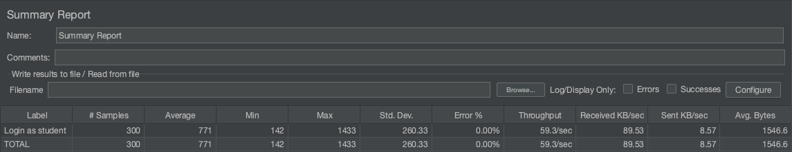

# ES21 PEE submission, Student NN

## Feature PAP

### Student

 - Nome, istID, githubID

### Listed features

Below, we list **only** the implemented features. For each feature, we link the relevant files and we mark which are requested parts are completed.

#### Feature number 1: Teacher creates a question

 - [x] [Service](https://github.com)
 - [x] [Service tests](https://github.com)
 - [x] [Webservice tests](https://github.com)
   
##### Test Coverage Screenshot

The screenshot includes the test coverage results associated with the new/changed entities:

#### Feature number N: **TODO**

 - [x] [Service](https://github.com)
 - [x] [Service tests](https://github.com)
 - [ ] [Webservice test](https://github.com)

##### Test Coverage Screenshot

The screenshot includes the test coverage results associated with the new/changed entities:

### End-to-end tests

#### Created tests

- [Login creates and deletes a course execution](https://github.com/socialsoftware/quizzes-tutor/blob/6dcf668498be3d6e45c84ebf61e81b931bdc797b/frontend/tests/e2e/specs/admin/manageCourseExecutions.js#L10)
- [Login creates two course executions and deletes it](https://github.com/socialsoftware/quizzes-tutor/blob/6dcf668498be3d6e45c84ebf61e81b931bdc797b/frontend/tests/e2e/specs/admin/manageCourseExecutions.js#L16)
- [Login creates FROM a course execution and deletes it](https://github.com/socialsoftware/quizzes-tutor/blob/6dcf668498be3d6e45c84ebf61e81b931bdc797b/frontend/tests/e2e/specs/admin/manageCourseExecutions.js#L30)

#### Commands defined

- [commands.js](https://github.com/socialsoftware/quizzes-tutor/blob/master/frontend/tests/e2e/support/commands.js)

#### Screenshot of test results overview

### JMeter Load test

- [LoadJMeter](https://github.com)

#### Screenshots of Reports

---
